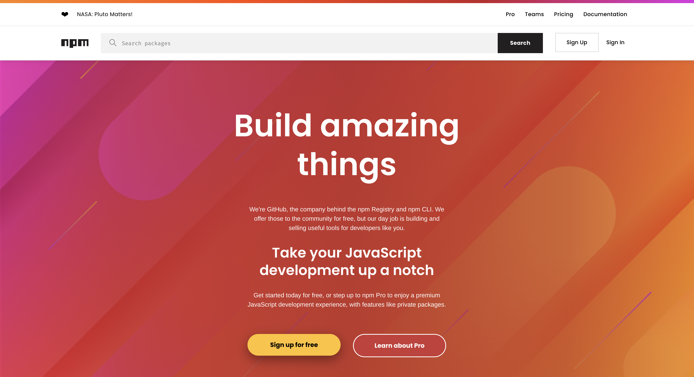
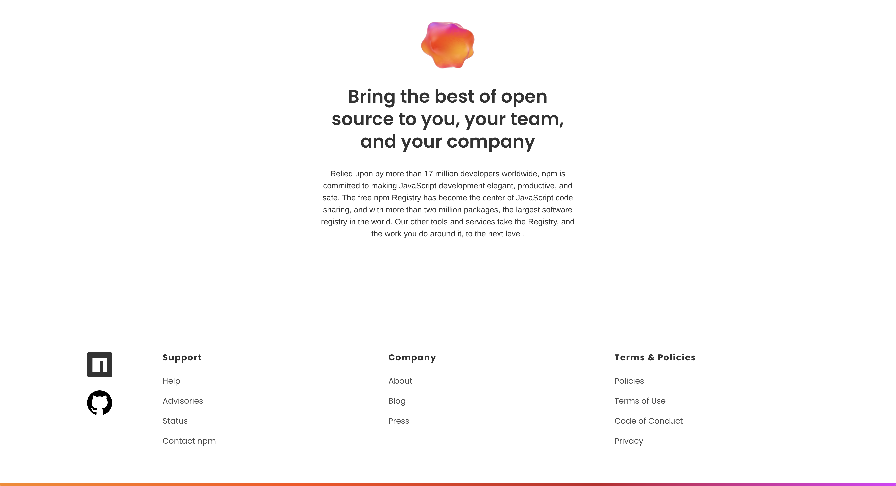

## Copia la web
La mejor manera de poder poner en práctica todo lo que hemos aprendido en HTML y CSS es copiando una web sencilla como es https://www.npmjs.com/

Esta web la utilizaremos en un futuro para poder descargar paquetes que serán de gran ayuda al programar... pero eso es un problema de los developers del futuro, ahora nos interesa HTML y CSS.

# ¿Qué tengo que hacer?
Sencillo, copiar el aspecto de la web completa, no la funcionalidad, es decir, lo que ves tendrás que reproducirlo de la manera más similar que puedas en tu proyecto. 

Tienes la estructura de archivos y carpetas del proyecto hecha y organizada. 

- index.html
- styles.css
- assets/img

Los archivos index.html y styles.css están completamente vacíos para que puedas comenzar desde 0 tu proyecto. No olvides crear bien la estructura del HTML y "enganchar" las CSS.

En assets/img tienes todas las imgenes necesarias. Además aquí tienes el corazón que aparece al inicio ❤ para que lo copies y lo pegues en tu proyecto.

En el momento de crear el ejercicio tiene el siguiente aspecto:

WARNING! Si la web no se parece en el momento de realizar el ejercicio usa tu ingenio, consigue las imagenes y haz la estructura similar en ese momento. 

# ¿Qué usaremos?
- Etiquetas semánticas
- Inputs
- Títulos
- Párrafos
- Backgrounds
- Sombreados
- Borders
- Margins y paddings
- Flex
- ...

Puedes usar todo lo de la lista y además lo que se te ocurra para poder hacer que tu proyecto se parezca a lo que ves. No hay límites.

# BONUS

Intenta que la tipográfia sea igual o similar a lo que ves. Usa la imaginación (e internet) para poder encontrar la manera de saber que tipografía es y como ponerla en tu proyecto.

También puedes poner una burbuja flotante abajo a la derecha con un telefono o algo que indique que es una interacción de contacto, que se mantenga fija durante toda la navegación.
